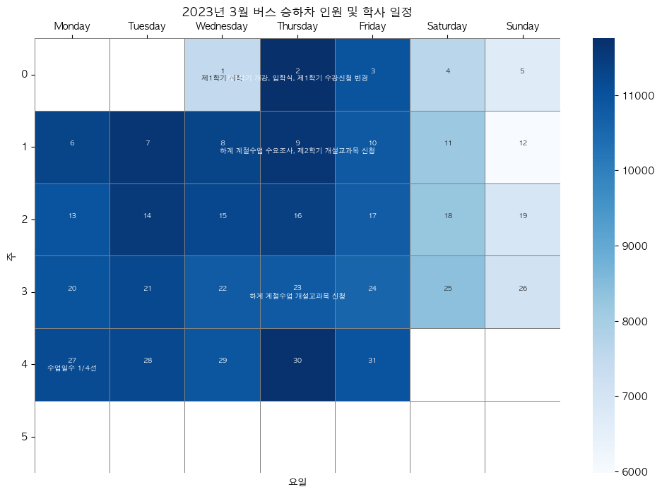
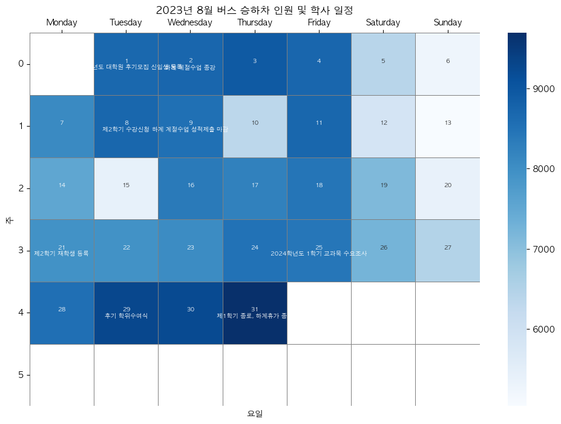
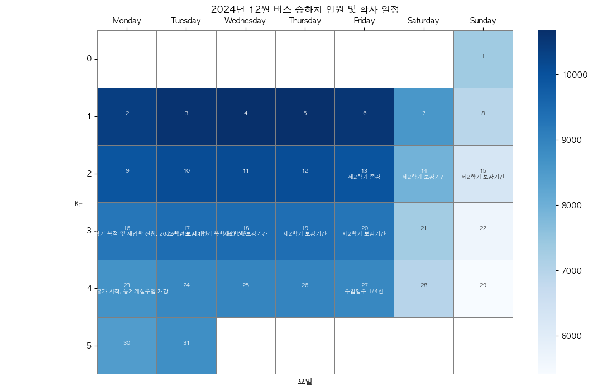
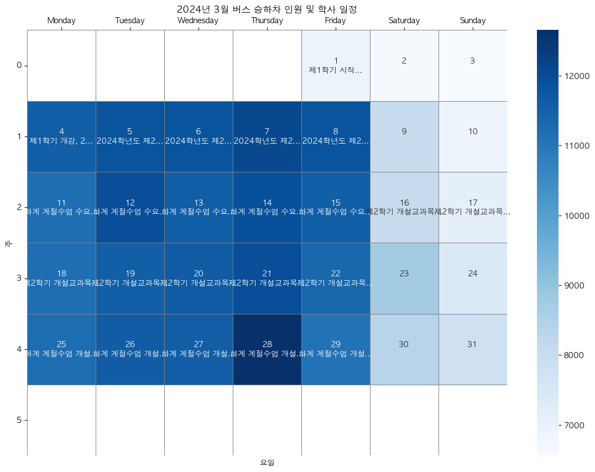
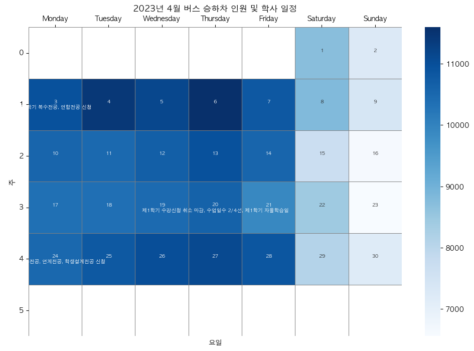

<style>
  .selector-container {
    display: flex;
    align-items: center;
    padding: 10px;
  }

  label {
    margin-right: 10px;
    font-size: 16px;
    font-weight: bold;
  }

  select {
    width: 200px;
    padding: 10px;
    border-radius: 5px;
    border: 1px solid #ccc;
    box-shadow: 0 2px 4px rgba(0,0,0,0.1);
    font-size: 16px;
    cursor: pointer;
  }

  select:focus {
    outline: none;
    border-color: #5c67f2;
    box-shadow: 0 0 8px rgba(92, 103, 242, 0.5);
  }

  option {
    padding: 8px 10px;
  }
   @import url("https://fonts.googleapis.com/css?family=Noto+Serif+KR&display=swap");
  body {
    font-family: "Noto Serif KR", serif;
  }
</style>

# 관악02 히트맵

서울대학교 학사일정 크롤링 진행하였습니다.
해당 학사일정과 승차인원을 매칭하여 히트맵을 그려봤습니다.

<select id="yearSelector">
  <option value="202303">2023년 3월</option>
  <option value="202304">2023년 4월</option>
  <option value="202308">2023년 8월</option>
  <option value="202403">2024년 3월</option>
  <option value="202412">2024년 12월</option>
</select>

<div class="grid grid-cols-1">
  <div  id = "card1" class="card" style= "display:none;">
    
  </div>
  <div id = "card2" class="card" style= "display:none;">
    
  </div>
  <div id = "card3" class="card" style= "display:none;">
    
  </div>
  <div id = "card4" class="card" style= "display:none;">
    
  </div>
  <div id = "card5" class="card" style= "display:none;">
    
  </div>
</div>

</div>

```js
document.getElementById("yearSelector").addEventListener("change", function () {
  // Hide all cards
  document.querySelectorAll(".card").forEach((card) => {
    card.style.display = "none";
  });

  // Display the card corresponding to the selected year
  const selectedYear = this.value;
  if (selectedYear === "202303") {
    document.getElementById("card1").style.display = "block";
  } else if (selectedYear === "202308") {
    document.getElementById("card2").style.display = "block";
  } else if (selectedYear === "202412") {
    document.getElementById("card3").style.display = "block";
  } else if (selectedYear === "202403") {
    document.getElementById("card4").style.display = "block";
  } else if (selectedYear === "202304") {
    document.getElementById("card5").style.display = "block";
  }
  // Add more conditions for other years if needed
});
```
