

  <h1>관악02 시각화 프로젝트</h1>
  <h2>시각화 4조, 김지영 김태형 이민영 이영아 윤형식 장은수 </h2>
  <a href="https://www.snukdt.com/">서울대 빅데이터 핀테크↗︎</a>

 이번 시각화 프로젝트를 진행하며 제작했던 자료들입니다. 

  

    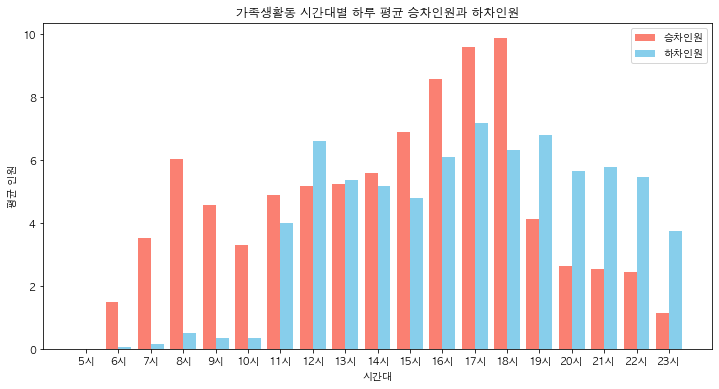
  

  

    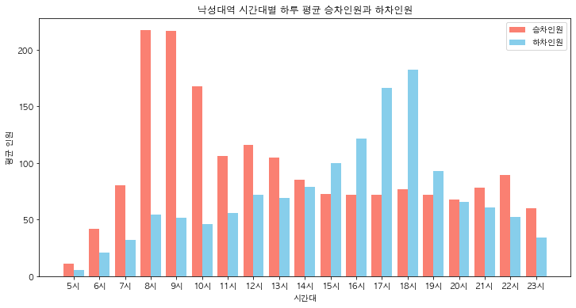
  

  

    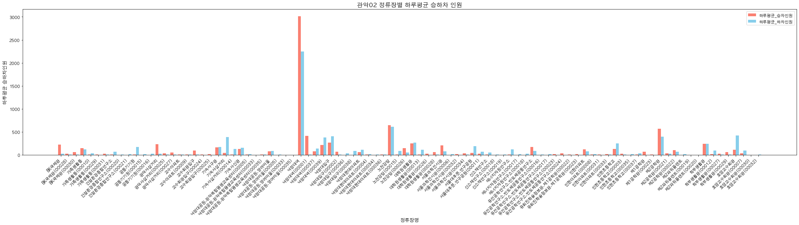
  

  

    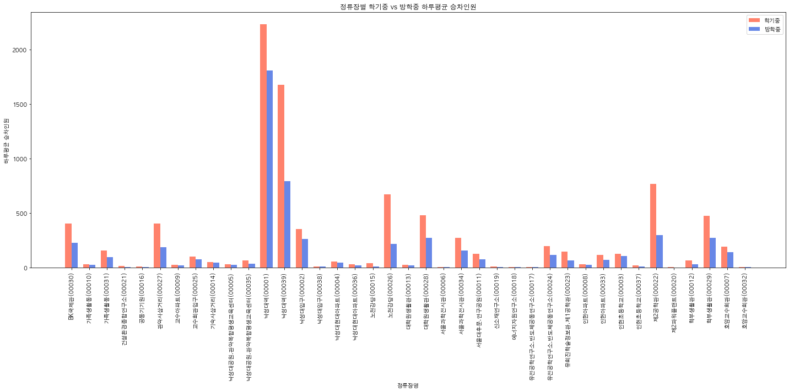
  

  

    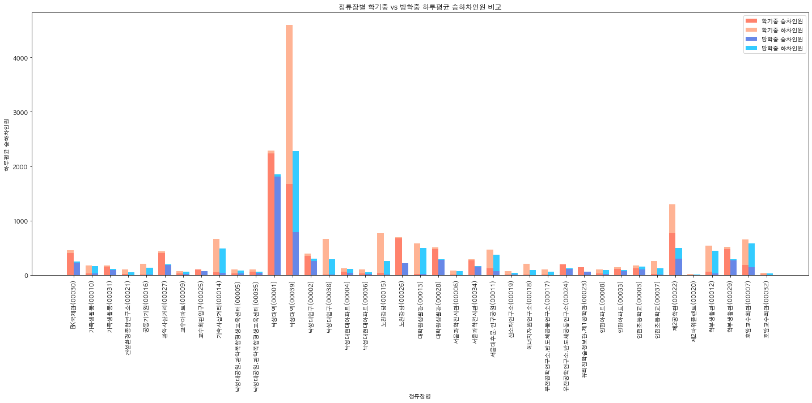
  

  

    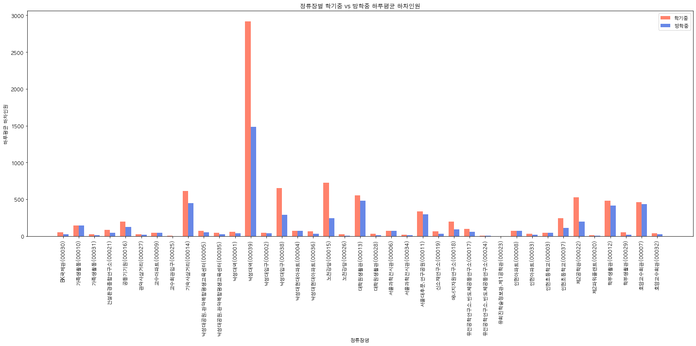
  

  

    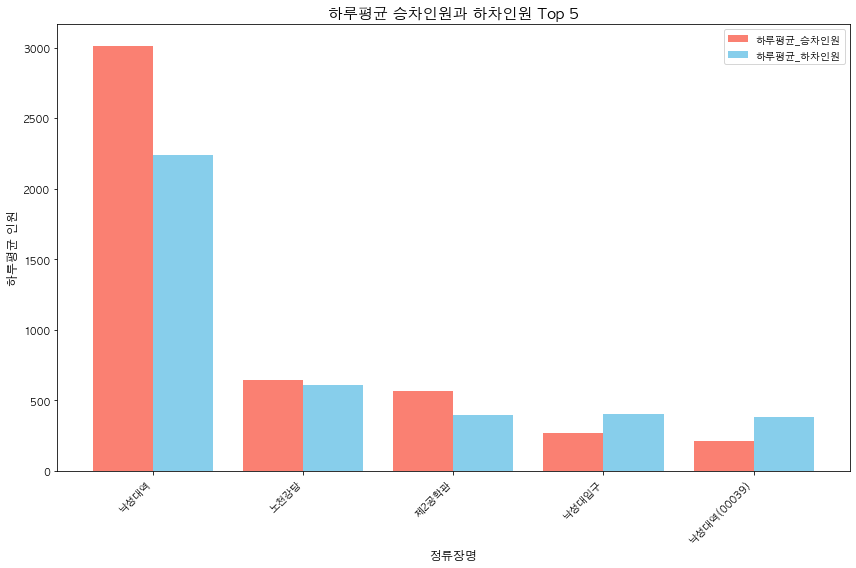
  

  

    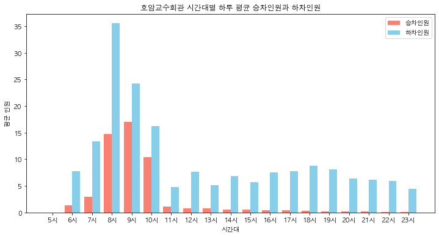
  

  

    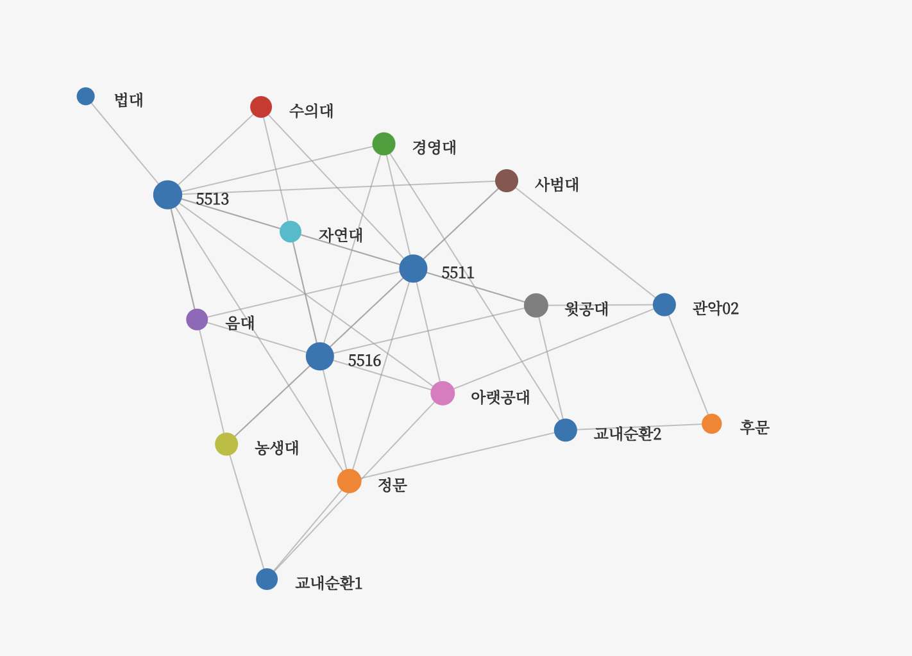
  

  

    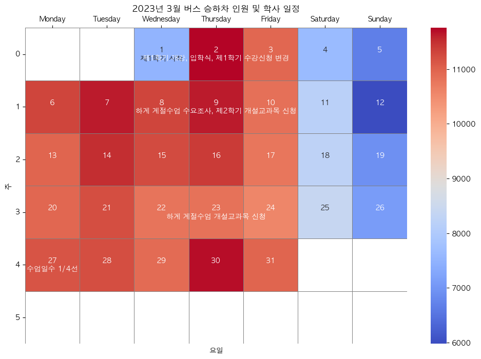
  

  

    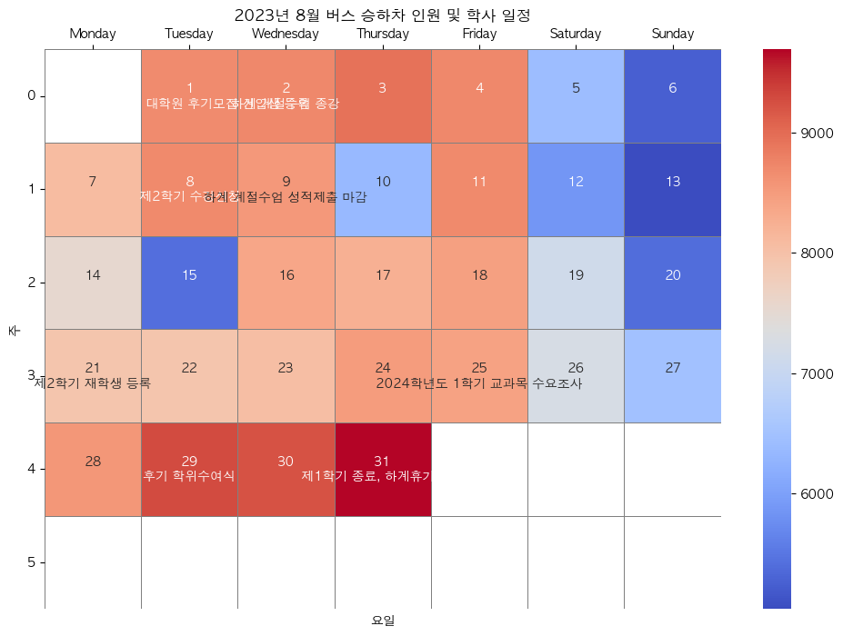
  

  

    
  

  

    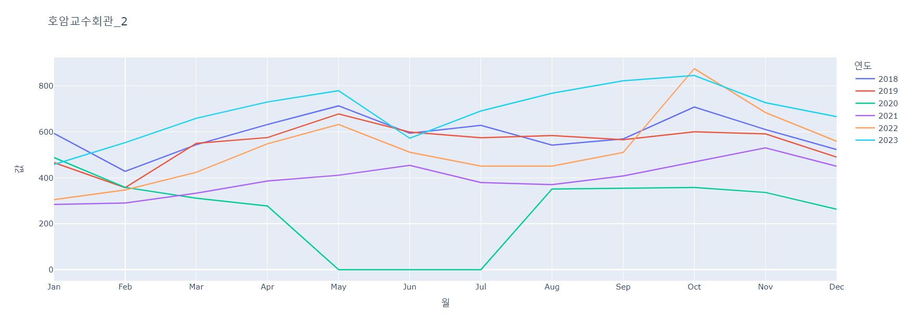
  

  

    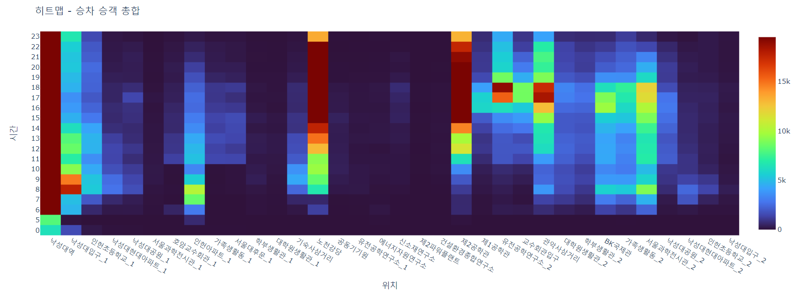
  

  

    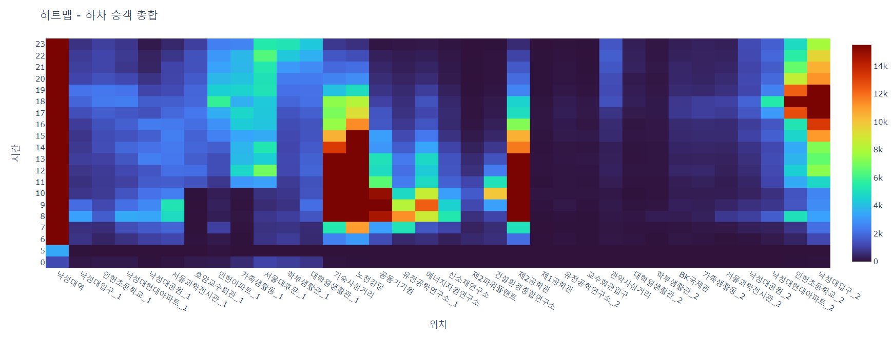
  

  

    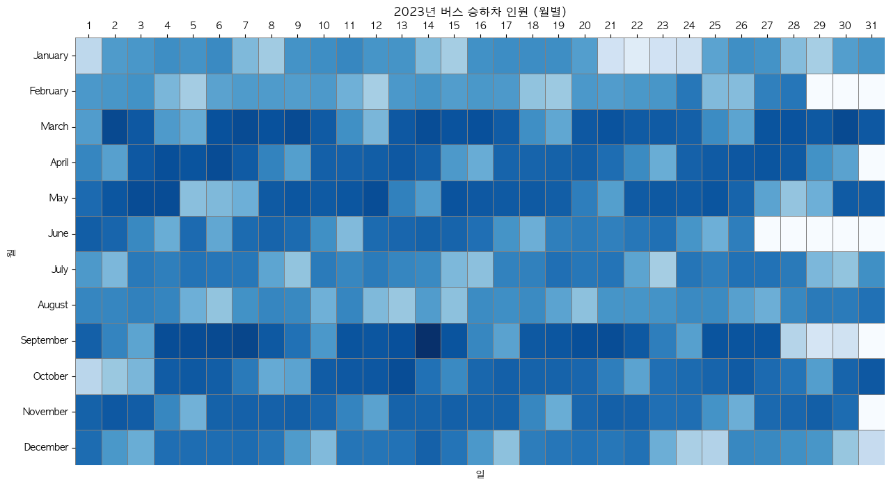
  

